<p align="center">
  
</p>

<p align="center">
  <strong>A fully async FastAPI backend with live payments, multi-layer auth, and enterprise-grade inventory — built from scratch.</strong>
</p>

<p align="center">
  <a href="#-quick-start"></a>
  <a href="#-architecture"></a>
  <a href="#-api-reference"></a>
  <a href="#-deep-dives"></a>
</p>

<p align="center">
  
  
  
  
  
  
  
</p>

<p align="center">
  
  
  
</p>

---

## ✨ Highlights

<table>
<tr>
<td width="50%">

**🔐 Multi-Layer Security**
- Argon2 password hashing with auto-rehash
- JWT access + refresh tokens with rotation
- Redis token blacklist (instant revocation)
- Refresh token theft detection
- Dual-layer rate limiting (IP + username)
- Session invalidation on password change

</td>
<td width="50%">

**💳 Live Payment Processing**
- Razorpay order creation via `run_in_executor`
- Gateway-first design (zero DB side effects on failure)
- Cryptographic signature verification
- Server-side webhook with HMAC-SHA256
- Audit log written before business logic
- Idempotent duplicate event handling

</td>
</tr>
<tr>
<td width="50%">

**📦 Inventory Audit Trail**
- Immutable `StockMovement` entries for every change
- `before → after` snapshots on each operation
- Atomic row-level stock guards (no oversell)
- Low-stock alerts & reorder point monitoring
- Admin restock, adjust, threshold management

</td>
<td width="50%">

**🎟️ Coupon & Discount Engine**
- Percentage & flat discounts with cap support
- Per-user + global usage limits
- Date-range validity with timezone awareness
- Race-condition protection via `SELECT ... FOR UPDATE`
- Full rollback on order cancellation

</td>
</tr>
<tr>
<td width="50%">

**⚙️ Async Task Queue**
- Celery workers with Redis broker
- HTML invoice emails (styled, auto-retry ×3)
- Email failures never roll back payments
- Decoupled from the payment commit path

</td>
<td width="50%">

**🏗️ Clean Architecture**
- Service-layer pattern (thin routes, fat services)
- 20+ domain-specific exceptions
- 6 global error handlers (zero raw exceptions)
- Pydantic v2 schemas for all I/O
- Alembic migrations, Docker-first setup

</td>
</tr>
</table>

---

## 🏛 Architecture

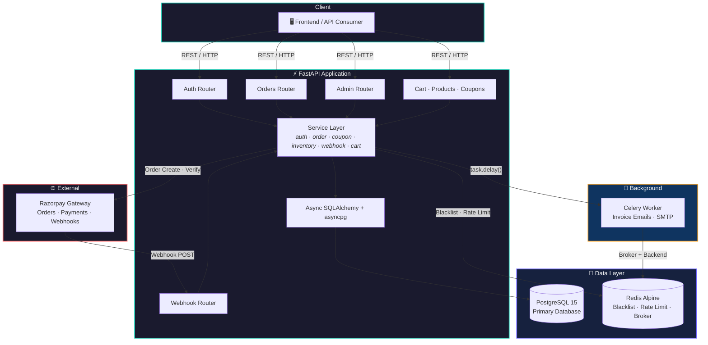

---

## 🔄 Deep Dives

### 🔐 Authentication Flow

> **5-step validation chain** on every protected request — from Redis blacklist check to session invalidation detection.

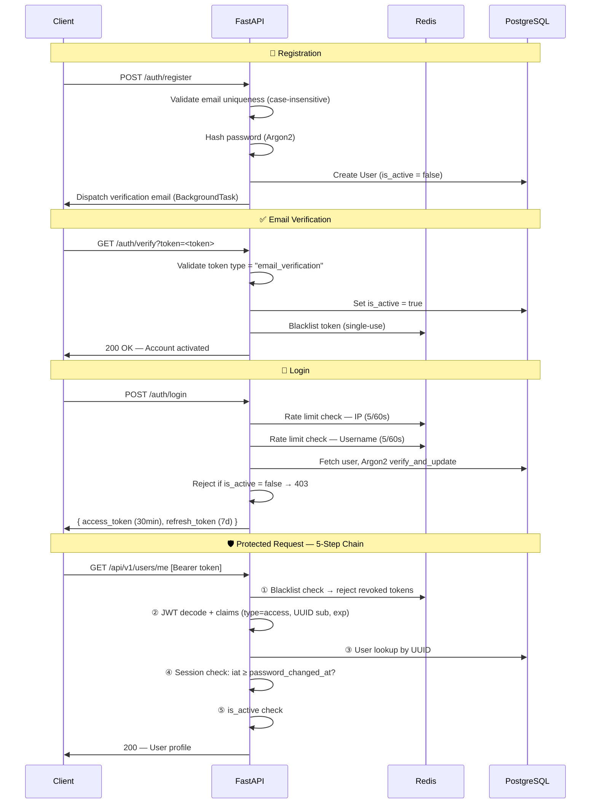

<details>
<summary><b>🔄 Token Lifecycle — Refresh, Logout & Theft Detection</b></summary>

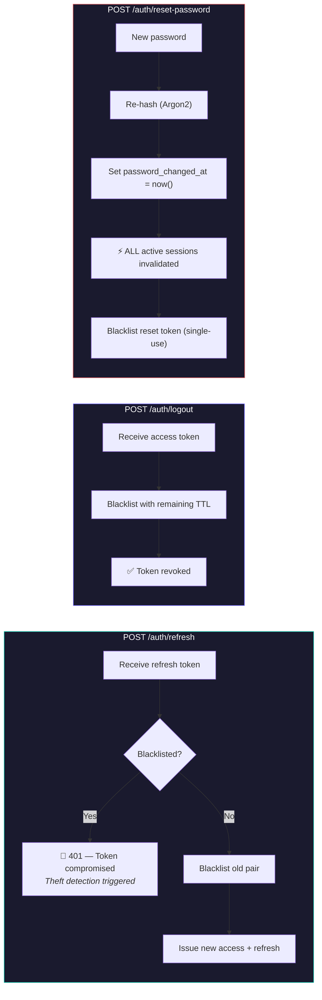

</details>

---

### 💳 Payment & Checkout Flow

> **Design principle:** Razorpay order is created *before* any database writes. A gateway failure leaves zero side effects.

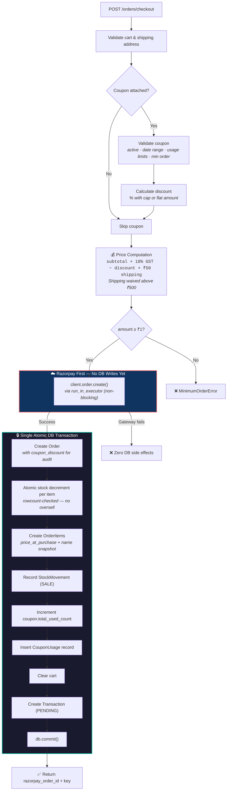

<details>
<summary><b>✅ Payment Verification (Client-Side Confirmation)</b></summary>

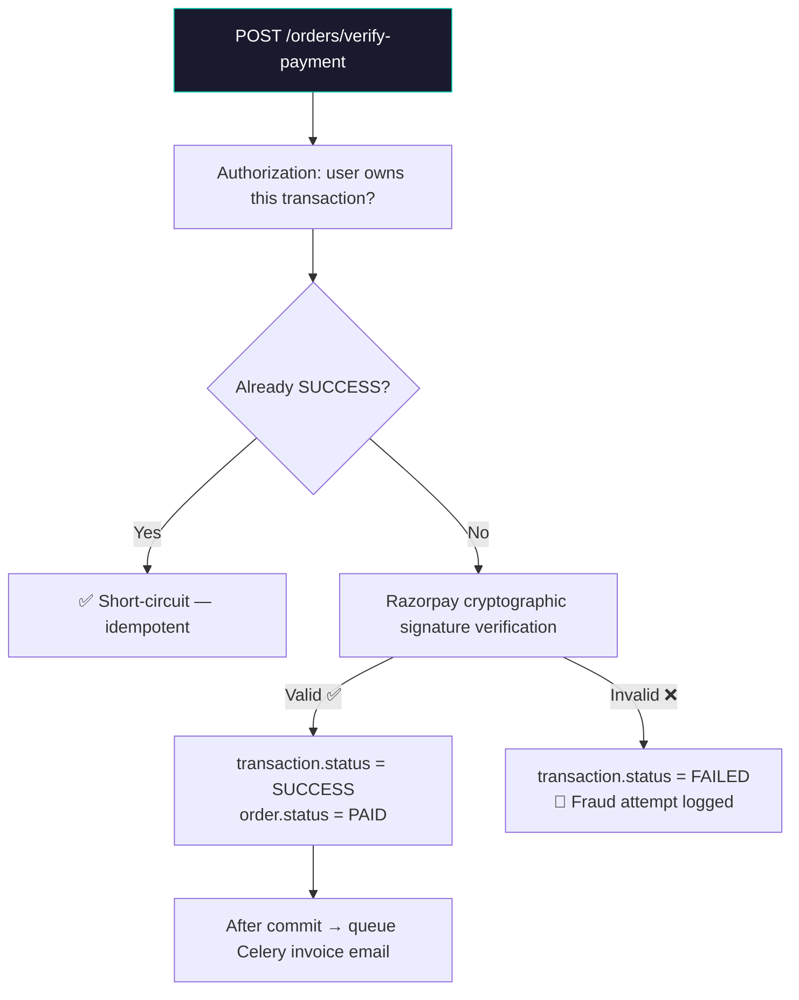

</details>

---

### 📬 Webhook Handler

> **Reliability-first:** audit log persisted *before* any business logic. Idempotent on duplicates. Email failures never affect payment state.

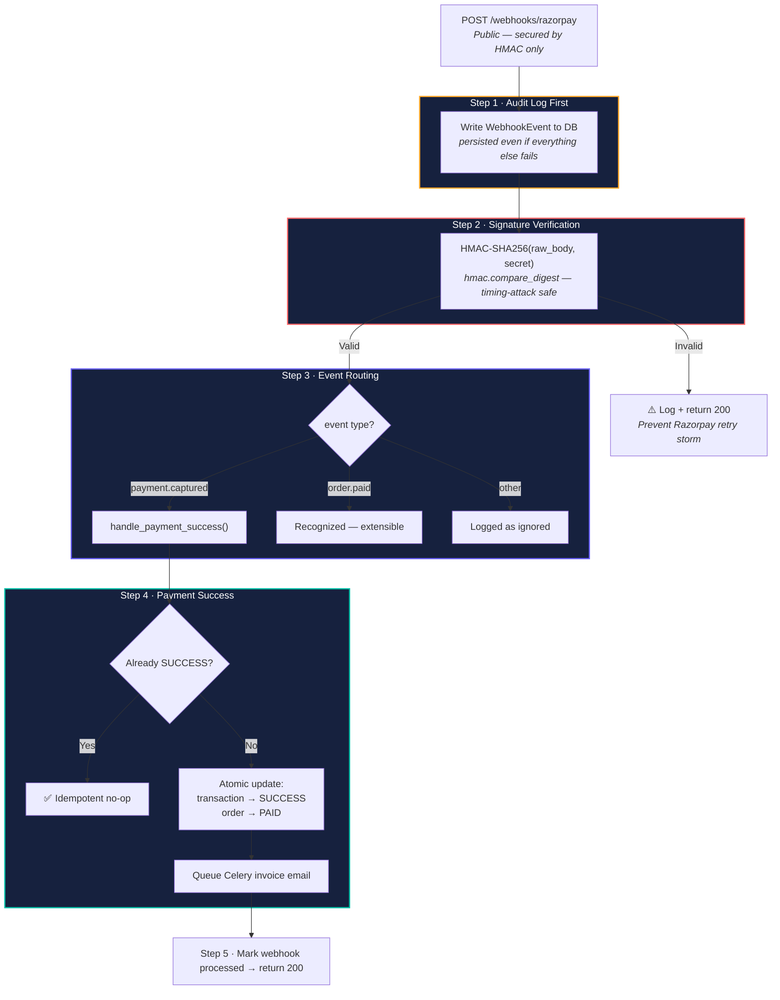

---

### 📦 Order Lifecycle

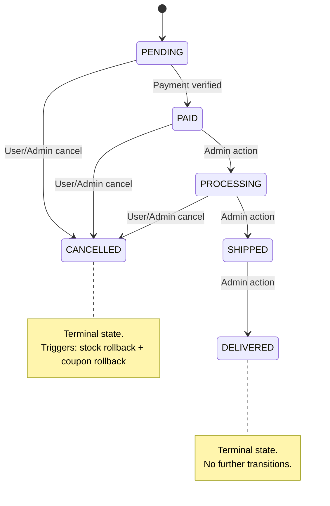

<details>
<summary><b>♻️ Cancellation — What Gets Rolled Back</b></summary>

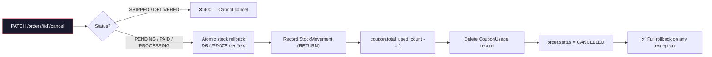

</details>

---

### 🎟️ Coupon Engine

> **7-step validation** with race-condition protection at checkout using `SELECT ... FOR UPDATE`.

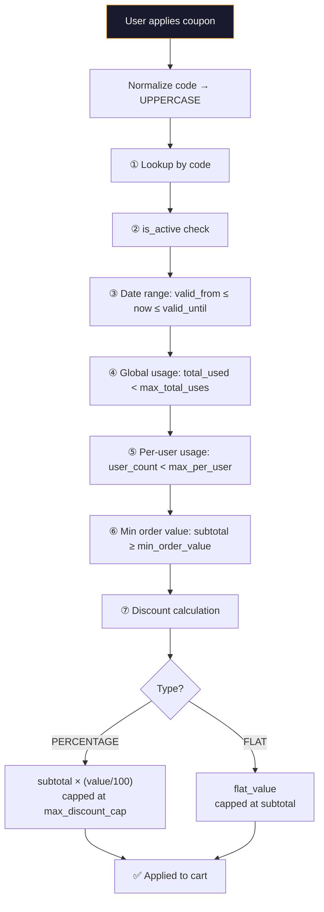

<details>
<summary><b>🔄 Coupon Lifecycle — Apply → Checkout → Cancellation Rollback</b></summary>

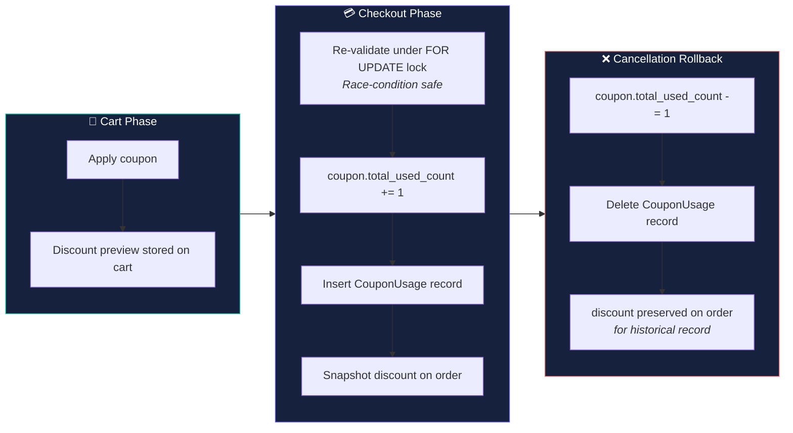

</details>

---

### 📊 Inventory System

> Every stock change — sale, cancellation, restock, or admin adjustment — is recorded as an **immutable `StockMovement` entry** with `before → after` snapshots.

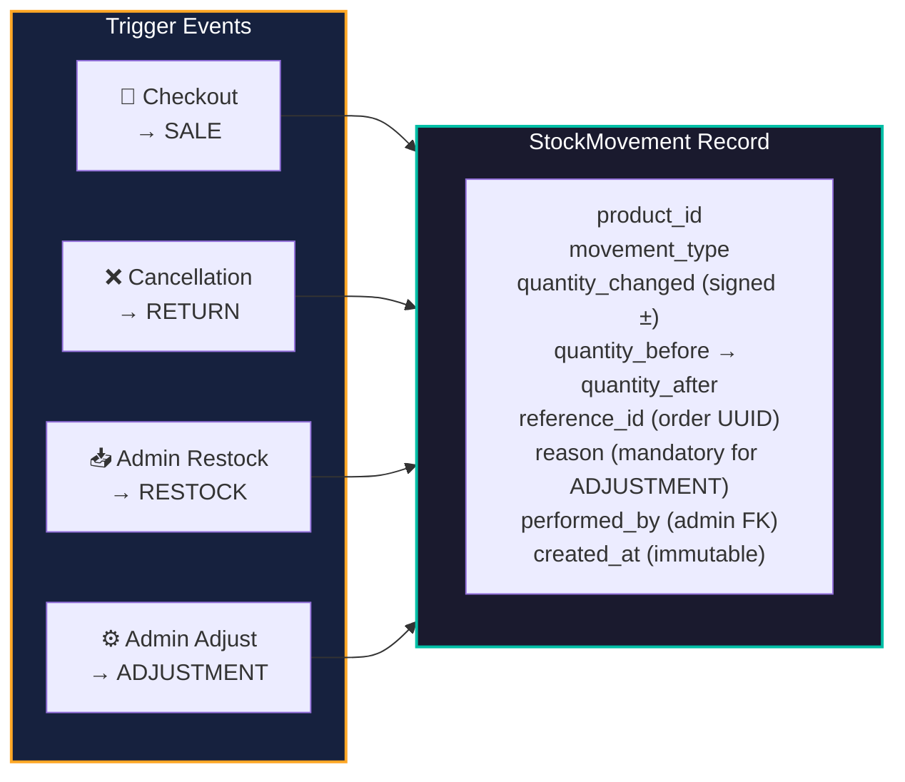

---

### ⚙️ Celery Invoice Email Pipeline

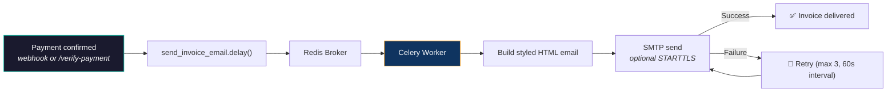

> **Key guarantee:** Email failures are logged as warnings — the payment DB state is **never** rolled back.

---

### 🚨 Exception Architecture

```mermaid
flowchart TD
    EX["Exception (Python)"]
    EX --> AE["AppException (Base)<br/><i>status_code · error_code · message</i>"]
    
    AE --> BR["BadRequestError (400)"]
    AE --> UA["UnauthorizedError (401)"]
    AE --> FB["ForbiddenError (403)"]
    AE --> NF["NotFoundError (404)"]
    AE --> CF["ConflictError (409)"]
    AE --> RL["RateLimitError (429)"]
    AE --> SU["ServiceUnavailableError (503)"]

    BR --> BR1["CartEmptyError"]
    BR --> BR2["InsufficientStockError"]
    BR --> BR3["PaymentVerificationError"]
    BR --> BR4["OrderCancellationError"]
    BR --> BR5["CouponExpiredError"]
    BR --> BR6["NegativeStockError"]
    
    UA --> UA1["AuthenticationError"]
    UA --> UA2["TokenCompromisedError"]
    UA --> UA3["SessionInvalidatedError"]
    
    NF --> NF1["CouponNotFoundError"]
    
    CF --> CF1["EmailAlreadyExistsError"]
    CF --> CF2["UsernameAlreadyExistsError"]
    
    SU --> SU1["PaymentGatewayError"]
    SU --> SU2["DatabaseError"]

    style AE fill:#16213e,stroke:#00BFA6,stroke-width:2px,color:#fff
    style BR fill:#1a1a2e,stroke:#FF6B6B,color:#fff
    style UA fill:#1a1a2e,stroke:#FFA726,color:#fff
    style FB fill:#1a1a2e,stroke:#6C63FF,color:#fff
    style NF fill:#1a1a2e,stroke:#6C63FF,color:#fff
    style CF fill:#1a1a2e,stroke:#6C63FF,color:#fff
    style RL fill:#1a1a2e,stroke:#FFA726,color:#fff
    style SU fill:#1a1a2e,stroke:#FF6B6B,color:#fff
```

6 global handlers catch everything — **no raw exceptions reach the client:**

| Handler | Catches | Response |
|:---|:---|:---|
| `app_exception_handler` | All `AppException` subclasses | `{ error_code, message, path }` |
| `validation_exception_handler` | Pydantic `RequestValidationError` | `422` + field-level details |
| `integrity_error_handler` | SQLAlchemy `IntegrityError` | `409` — duplicate/constraint |
| `sqlalchemy_exception_handler` | SQLAlchemy `SQLAlchemyError` | `500` — generic DB error |
| `redis_exception_handler` | `RedisError` | `503` — cache unavailable |
| `generic_exception_handler` | `Exception` (safety net) | `500` — unhandled fallback |

---

## 📁 Project Structure

```
E-Commerce/
├── app/
│   ├── main.py                         # App entry + router registration + error handlers
│   ├── api/
│   │   ├── dependencies.py             # get_current_user, require_roles, token chain
│   │   └── v1/
│   │       ├── auth.py                 # Register, login, refresh, verify, reset
│   │       ├── products.py             # Catalog CRUD & categories
│   │       ├── cart.py                 # Cart management (add, update, remove)
│   │       ├── order.py                # Checkout, verify-payment, cancel
│   │       ├── address.py              # Address book with soft-delete
│   │       ├── users.py                # User profile & order history
│   │       ├── admin.py                # Admin — products, orders, state machine
│   │       ├── coupon.py               # Coupon apply/remove + admin CRUD
│   │       ├── inventory.py            # Inventory admin (restock, adjust, alerts)
│   │       └── webhooks.py             # Razorpay webhook receiver
│   ├── core/
│   │   ├── config.py                   # Pydantic settings (env-driven)
│   │   ├── security.py                 # JWT (access, refresh, reset, verify tokens)
│   │   ├── redis.py                    # Rate limiting utility
│   │   ├── exceptions.py               # 20+ domain exception classes
│   │   ├── error_handlers.py           # 6 global exception handlers
│   │   └── logging_config.py           # Structured logging
│   ├── db/
│   │   ├── session.py                  # Async session factory
│   │   └── models/
│   │       ├── user.py                 # User + password_changed_at
│   │       ├── product.py              # Product + stock + thresholds
│   │       ├── cart.py                 # Cart + CartItem + subtotal
│   │       ├── order.py                # Order + OrderItem + status enum
│   │       ├── transaction.py          # Razorpay transaction record
│   │       ├── address.py              # Shipping address + soft-delete
│   │       ├── coupon.py               # Coupon + CouponUsage + DiscountType
│   │       ├── inventory.py            # StockMovement + StockMovementType
│   │       └── webhook_event.py        # Webhook audit log
│   ├── schemas/                        # Pydantic v2 request/response models
│   ├── services/
│   │   ├── order_service.py            # Checkout, verify, cancel, state machine
│   │   ├── coupon_service.py           # Validate, apply, use-in-checkout, rollback
│   │   ├── inventory_service.py        # Stock movements, adjust, restock, alerts
│   │   ├── webhook_service.py          # HMAC verify, event routing, idempotency
│   │   └── ...                         # Auth, cart, product services
│   ├── validators/                     # Reusable field-level validators
│   ├── utils/
│   │   └── email.py                    # FastAPI-Mail background sender
│   └── worker/
│       ├── celery_app.py               # Celery instance (Redis broker + backend)
│       └── tasks.py                    # send_invoice_email (HTML, retry ×3)
├── alembic/                            # Database migration scripts
├── backend/
│   └── docker-compose.yml              # PostgreSQL + Redis + API + Celery
├── Dockerfile
├── requirements.txt
└── pytest.ini
```

---

## 🔗 API Reference

<details>
<summary><b>🔐 Auth</b> — <code>/auth</code> — Registration, login, token management</summary>

| Method | Endpoint | Auth | Description |
|:---|:---|:---|:---|
| `POST` | `/auth/register` | — | Register + send verification email |
| `GET` | `/auth/verify` | — | Activate account via email token |
| `POST` | `/auth/resend-verification` | — | Resend email (2-min Redis cooldown) |
| `POST` | `/auth/login` | — | Returns access + refresh token pair |
| `POST` | `/auth/refresh` | — | Rotate refresh token (theft detection) |
| `POST` | `/auth/logout` | Bearer | Blacklist access token |
| `POST` | `/auth/forgot-password` | — | Trigger reset (generic response) |
| `POST` | `/auth/reset-password` | — | Reset + invalidate all sessions |

</details>

<details>
<summary><b>👤 Users</b> — <code>/api/v1/users</code> — Profile & history</summary>

| Method | Endpoint | Auth | Description |
|:---|:---|:---|:---|
| `GET` | `/api/v1/users/me` | Bearer | Get own profile |
| `PATCH` | `/api/v1/users/me` | Bearer | Update name, email, phone |
| `GET` | `/api/v1/users/me/orders` | Bearer | Order history (paginated) |

</details>

<details>
<summary><b>📦 Catalog</b> — <code>/api/v1/products</code> — Products & categories</summary>

| Method | Endpoint | Auth | Description |
|:---|:---|:---|:---|
| `POST` | `/api/v1/products/categories` | Public | Create category |
| `GET` | `/api/v1/products/categories` | Public | List categories |
| `GET` | `/api/v1/products/` | Public | List active products (paginated) |
| `GET` | `/api/v1/products/{id}` | Public | Product detail |
| `POST` | `/api/v1/products/` | Public | Create product |
| `DELETE` | `/api/v1/products/{id}` | Public | Soft-delete product |

</details>

<details>
<summary><b>🛒 Cart</b> — <code>/api/v1/cart</code> — Cart management</summary>

| Method | Endpoint | Auth | Description |
|:---|:---|:---|:---|
| `GET` | `/api/v1/cart/` | Bearer | View cart (auto-creates if missing) |
| `POST` | `/api/v1/cart/items` | Bearer | Add item (stock validated) |
| `PUT` | `/api/v1/cart/items/{id}` | Bearer | Set quantity |
| `PATCH` | `/api/v1/cart/items/{id}/decrease` | Bearer | Decrease by 1 (auto-removes at 0) |
| `DELETE` | `/api/v1/cart/items/{id}` | Bearer | Remove item |
| `DELETE` | `/api/v1/cart/` | Bearer | Clear entire cart |

</details>

<details>
<summary><b>💳 Orders</b> — <code>/api/v1/orders</code> — Checkout & payments</summary>

| Method | Endpoint | Auth | Description |
|:---|:---|:---|:---|
| `POST` | `/api/v1/orders/checkout` | Bearer | Create Razorpay order + DB order (atomic) |
| `POST` | `/api/v1/orders/verify-payment` | Bearer | Verify signature → mark PAID |
| `GET` | `/api/v1/orders/` | Bearer | List user's paid orders |
| `GET` | `/api/v1/orders/{id}` | Bearer | Order detail |
| `PATCH` | `/api/v1/orders/{id}/cancel` | Bearer | Cancel + stock + coupon rollback |

</details>

<details>
<summary><b>🎟️ Coupons</b> — User & Admin coupon operations</summary>

| Method | Endpoint | Auth | Description |
|:---|:---|:---|:---|
| `POST` | `/api/v1/coupons/cart/apply-coupon` | Bearer | Apply coupon to cart |
| `DELETE` | `/api/v1/coupons/cart/remove-coupon` | Bearer | Remove coupon from cart |
| `POST` | `/api/v1/admin/coupons` | Admin | Create coupon |
| `GET` | `/api/v1/admin/coupons` | Admin | List coupons (filterable) |
| `GET` | `/api/v1/admin/coupons/{code}` | Admin | Get coupon by code |
| `PATCH` | `/api/v1/admin/coupons/{code}` | Admin | Partial update |
| `PATCH` | `/api/v1/admin/coupons/{code}/deactivate` | Admin | Deactivate coupon |

</details>

<details>
<summary><b>🛠️ Admin</b> — <code>/api/v1/admin</code> — Product & order management</summary>

| Method | Endpoint | Auth | Description |
|:---|:---|:---|:---|
| `POST` | `/api/v1/admin/products` | Admin | Create product |
| `GET` | `/api/v1/admin/products` | Admin | List all (incl. soft-deleted) |
| `PATCH` | `/api/v1/admin/products/{id}` | Admin | Partial update |
| `DELETE` | `/api/v1/admin/products/{id}` | Admin | Soft-delete |
| `GET` | `/api/v1/admin/orders` | Admin | List all orders (status filter) |
| `PATCH` | `/api/v1/admin/orders/{id}/status` | Admin | State-machine validated transition |

</details>

<details>
<summary><b>📊 Inventory</b> — <code>/api/v1/admin/inventory</code> — Stock management</summary>

| Method | Endpoint | Auth | Description |
|:---|:---|:---|:---|
| `GET` | `/admin/inventory/low-stock` | Admin | Products below threshold |
| `GET` | `/admin/inventory/reorder-alerts` | Admin | Products at/below reorder point |
| `GET` | `/admin/inventory/report` | Admin | Aggregated stock summary |
| `GET` | `/admin/inventory/{id}/movements` | Admin | Movement history (filterable) |
| `POST` | `/admin/inventory/{id}/adjust` | Admin | ± stock delta with reason |
| `POST` | `/admin/inventory/{id}/restock` | Admin | Add positive stock |
| `PATCH` | `/admin/inventory/{id}/thresholds` | Admin | Update alert thresholds |

</details>

<details>
<summary><b>📍 Addresses & Webhooks</b></summary>

| Method | Endpoint | Auth | Description |
|:---|:---|:---|:---|
| `GET` | `/api/v1/addresses/` | Bearer | List addresses |
| `POST` | `/api/v1/addresses/` | Bearer | Add address (first = auto-default) |
| `PATCH` | `/api/v1/addresses/{id}` | Bearer | Update |
| `PATCH` | `/api/v1/addresses/{id}/default` | Bearer | Set as default (atomic) |
| `DELETE` | `/api/v1/addresses/{id}` | Bearer | Soft-delete |
| `POST` | `/api/v1/webhooks/razorpay` | HMAC | Receive Razorpay payment events |

</details>

---

## 🚀 Quick Start

### Prerequisites

- Docker & Docker Compose
- Git

### 1. Clone & Configure

```bash
git clone https://github.com/Vishwam401/E-commerce.git
cd E-commerce
```

Create `.env.docker` in the project root:

```env
# ──── Database ────
DATABASE_URL=postgresql+asyncpg://postgres:vish@db:5432/ecommerce_db

# ──── JWT ────
SECRET_KEY=your_super_secret_key_min_32_chars
ALGORITHM=HS256
ACCESS_TOKEN_EXPIRE_MINUTES=30

# ──── Redis ────
REDIS_HOST=redis
REDIS_PORT=6379
REDIS_PASSWORD=your_redis_password

# ──── Email (Gmail SMTP) ────
MAIL_USERNAME=your_email@gmail.com
MAIL_PASSWORD=your_app_password
MAIL_FROM=your_email@gmail.com
MAIL_PORT=587
MAIL_SERVER=smtp.gmail.com
MAIL_STARTTLS=True
MAIL_SSL_TLS=False
EMAIL_VERIFY_BASE_URL=http://localhost:8001

# ──── Razorpay ────
RAZORPAY_KEY_ID=rzp_test_xxxxxxxxxxxx
RAZORPAY_SECRET_KEY=your_razorpay_secret
RAZORPAY_WEBHOOK_SECRET=your_razorpay_webhook_secret
```

### 2. Launch

```bash
cd backend
docker compose up --build -d
```

### 3. Run Migrations

```bash
docker compose exec api alembic upgrade head
```

### 4. Access

| Interface | URL |
|:---|:---|
| API Root | [`http://localhost:8001`](http://localhost:8001) |
| Swagger UI | [`http://localhost:8001/docs`](http://localhost:8001/docs) |
| ReDoc | [`http://localhost:8001/redoc`](http://localhost:8001/redoc) |

---

## 🛠 Tech Stack

| Layer | Technology | Purpose |
|:---|:---|:---|
| **Framework** | FastAPI 0.135 | Async REST API with auto-docs |
| **Language** | Python 3.11+ | Type hints, async/await |
| **Database** | PostgreSQL 15 | Primary data store (via asyncpg) |
| **ORM** | SQLAlchemy 2.0 | Fully async, mapped columns |
| **Migrations** | Alembic | Schema versioning |
| **Cache** | Redis Alpine | Token blacklist, rate limits, Celery broker |
| **Auth** | Argon2 + JWT | Hashing (passlib) + python-jose tokens |
| **Email** | smtplib (Celery) | Synchronous SMTP in worker (async-safe) |
| **Payments** | Razorpay SDK | Live order creation + signature verify |
| **Webhooks** | HMAC-SHA256 | Timing-attack safe via `compare_digest` |
| **Task Queue** | Celery | Redis broker + backend, auto-retry |
| **Validation** | Pydantic v2 | Request/response schemas |
| **Containers** | Docker Compose | PostgreSQL + Redis + API + Celery worker |

---

## ✅ Smoke Test Checklist

```
 1. POST  /auth/register                          → verification email sent
 2. GET   /auth/verify?token=...                  → account activated
 3. POST  /auth/login                             → save access + refresh tokens
 4. GET   /api/v1/users/me                        → profile returned
 5. POST  /api/v1/addresses/                      → add shipping address
 6. POST  /api/v1/cart/items                      → add products to cart
 7. POST  /api/v1/admin/coupons          (admin)  → create coupon
 8. POST  /api/v1/coupons/cart/apply-coupon       → attach coupon to cart
 9. POST  /api/v1/orders/checkout                 → receive razorpay_order_id
10. POST  /api/v1/orders/verify-payment           → mark PAID, invoice queued
11. POST  /api/v1/webhooks/razorpay               → test with valid HMAC header
12. PATCH /api/v1/orders/{id}/cancel              → stock + coupon rolled back
13. PATCH /api/v1/admin/orders/{id}/status        → test state machine transitions
14. GET   /api/v1/admin/inventory/report          → stock summary
15. POST  /api/v1/admin/inventory/{id}/restock    → test RESTOCK movement
16. 6+ bad logins                                 → 429 → wait 60s → 200
```

---

## 🗺 Roadmap

- [x] JWT auth with email verification, refresh rotation & theft detection
- [x] Redis token blacklist + dual-layer rate limiting
- [x] Full cart & order lifecycle with atomic stock management
- [x] Razorpay live payment integration + signature verification
- [x] Server-side webhook handler with audit log
- [x] Celery async invoice email (HTML, auto-retry)
- [x] Order state machine with validated transitions
- [x] Order cancellation with atomic stock + coupon rollback
- [x] Coupon engine (%, flat, caps, per-user limits, race-condition safe)
- [x] Inventory management — stock movement audit, low-stock alerts, reorder points
- [x] Admin panel — products, orders, coupons, inventory
- [x] Custom exception hierarchy (20+ classes) with structured global handlers
- [ ] Redis-backed cart caching
- [ ] Sentry error tracking integration
- [ ] Product reviews & ratings
- [ ] Wishlist / saved items

---

<p align="center">
  <sub>Built with ❤️ by <a href="https://github.com/Vishwam401">Vishwam401</a></sub>
</p>
