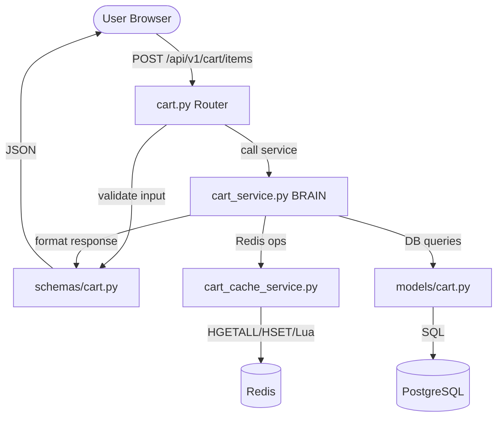
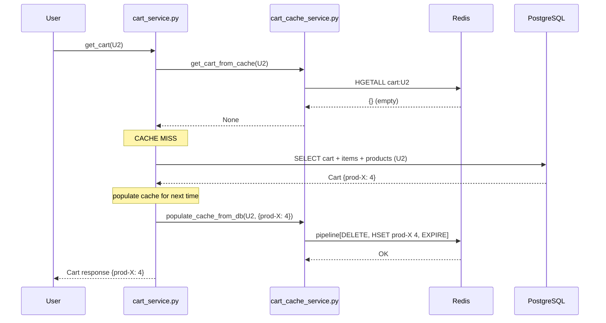
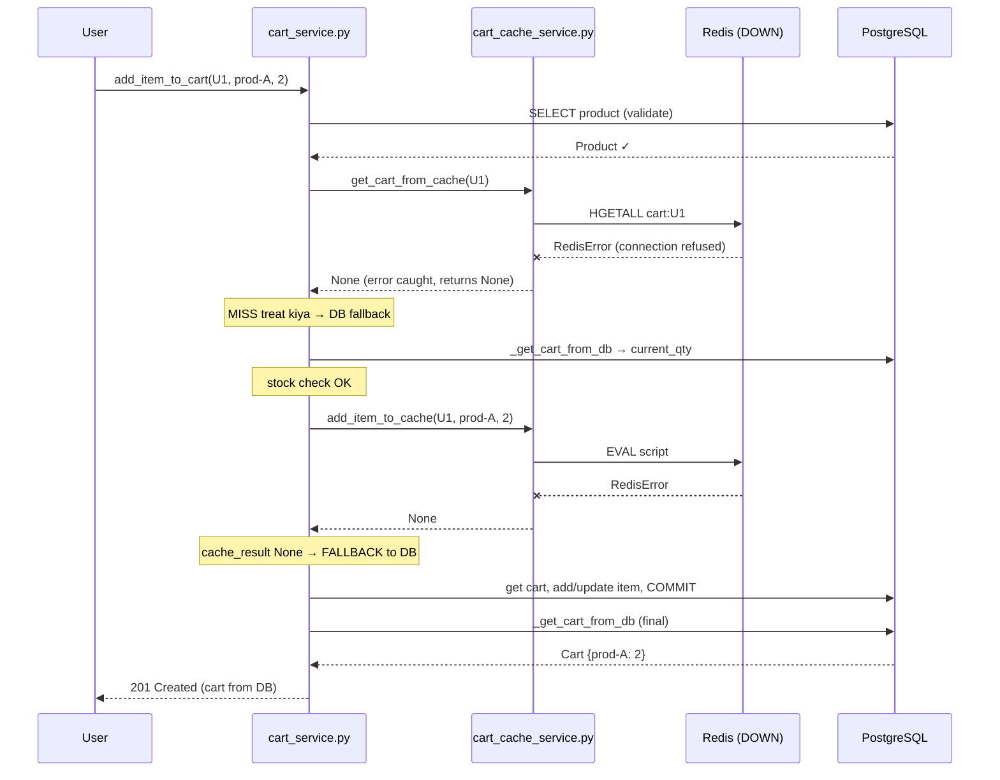

# Cart Caching — Complete Codebase Walkthrough (Dry Run Style)

> **Ye document kya hai**: Cart caching se related har file, har function, line-by-line — DSA dry-run style mein. Diagrams, flow charts, aur "yahan Redis, yahan DB" ka exact trace.
>
> **Kaise padhein**: Upar se neeche. Pehle architecture samjho, phir har file, phir end-to-end dry runs. Confuse ho to diagram dekho.

---

## Table of Contents

1. [Bade Picture — Kaun si file kya karti hai](#1-bade-picture)
2. [Data kahan store hoti hai — Redis vs DB](#2-data-kahan-store-hoti-hai)
3. [Files ka relationship (call chain)](#3-files-ka-relationship)
4. [File 1: cart.py (Router) — line by line](#4-file-1-router)
5. [File 2: schemas/cart.py — line by line](#5-file-2-schemas)
6. [File 3: models/cart.py — line by line](#6-file-3-models)
7. [File 4: cart_cache_service.py — line by line](#7-file-4-cache-service)
8. [File 5: cart_service.py — line by line](#8-file-5-cart-service)
9. [END TO END DRY RUNS (the important part)](#9-end-to-end-dry-runs)

---

## 1. Bade Picture

Cart caching 5 files ka team-work hai. Har file ka ek specific kaam hai:

```
┌──────────────────────────────────────────────────────────────┐
│                     CART SYSTEM — 5 FILES                      │
├──────────────────────────────────────────────────────────────┤
│                                                                │
│  1. cart.py (Router)                                           │
│     → HTTP requests receive karta hai (GET/POST/PUT/DELETE)    │
│     → Kaam: request ko service tak pahुंchana                  │
│                                                                │
│  2. schemas/cart.py (Pydantic)                                 │
│     → Input validate + Output format                           │
│     → Kaam: "quantity 0 se badi honi chahiye" jaise rules      │
│                                                                │
│  3. models/cart.py (SQLAlchemy ORM)                            │
│     → Database tables ka Python representation                 │
│     → Kaam: carts, cart_items tables ka structure              │
│                                                                │
│  4. cart_cache_service.py (Redis Layer)                        │
│     → Sirf Redis se baat karta hai                             │
│     → Kaam: Lua scripts, HGETALL, HSET — pure cache ops        │
│                                                                │
│  5. cart_service.py (Brain / Orchestrator)                     │
│     → Sabko coordinate karta hai                               │
│     → Kaam: "pehle cache, phir DB, phir sync" ka logic         │
│                                                                │
└──────────────────────────────────────────────────────────────┘
```

**Ek line mein**: Router request leta hai → Service (brain) decide karta hai → Cache service Redis handle karta hai → Models DB structure dete hain → Schemas response format karte hain.

---

## 2. Data Kahan Store Hoti Hai

Ye sabse important concept hai. **Do jagah data hai — Redis aur PostgreSQL. Dono mein kya hai, wo yaad rakhna.**

```
┌─────────────────────────────┐         ┌─────────────────────────────┐
│         REDIS (Fast)        │         │      PostgreSQL (Truth)     │
│                             │         │                             │
│  cart:{user_id}   (Hash)    │         │  carts table                │
│  ┌─────────────────────┐    │         │  ┌───────────────────────┐  │
│  │ product_id → qty    │    │         │  │ id, user_id,          │  │
│  │ "prod-A"    → "3"   │    │         │  │ coupon_code,          │  │
│  │ "prod-B"    → "1"   │    │         │  │ discount_amount,      │  │
│  └─────────────────────┘    │         │  │ created_at, updated   │  │
│                             │         │  └───────────────────────┘  │
│  cart:meta:{user_id} (Hash) │         │                             │
│  ┌─────────────────────┐    │         │  cart_items table           │
│  │ coupon_code  → "X"  │    │         │  ┌───────────────────────┐  │
│  │ discount_amt → "50" │    │         │  │ id, cart_id,          │  │
│  └─────────────────────┘    │         │  │ product_id, quantity  │  │
│                             │         │  └───────────────────────┘  │
│                             │         │                             │
│  ONLY: product_id + qty     │         │  products table             │
│  + coupon info              │         │  ┌───────────────────────┐  │
│                             │         │  │ id, name, PRICE,      │  │
│  NEVER: price, name         │         │  │ stock_quantity, slug  │  │
│                             │         │  └───────────────────────┘  │
└─────────────────────────────┘         └─────────────────────────────┘
        │                                          │
        │  FAST (in-memory, ~1ms)                  │  SLOWER (disk, ~10-50ms)
        │  Temporary (TTL = 7 days)                │  Permanent (source of truth)
        │  Can be lost                             │  Never lost
```

### Golden Rules (yaad rakho)

| Data | Kahan? | Kyun? |
|------|--------|-------|
| product_id + quantity | Redis + DB | Fast access chahiye |
| PRICE | **Sirf DB** | Security — Redis mein price rakhi to hack ho sakti hai |
| product name, slug | **Sirf DB** | Redis mein rakhna waste, DB se aa jaati hai |
| stock_quantity | **Sirf DB** | Hamesha authoritative hona chahiye |
| coupon_code, discount | Redis + DB | Cart ke saath sync rehna chahiye |

> **Kyun price Redis mein nahi?** Agar price Redis mein hoti aur koi attacker Redis manipulate kare — ₹999 ka item ₹1 ka bana de. Isliye price hamesha DB se aati hai checkout ke time.

---

## 3. Files Ka Relationship

Jab user "add to cart" karta hai, call is order mein jaati hai:



**Dependency direction** (kaun kisko call karta hai):

```
cart.py (router)
    │ calls
    ▼
cart_service.py (brain)  ─────┐
    │ calls                   │ uses
    ▼                         ▼
cart_cache_service.py    models/cart.py
    │ talks to                │ maps to
    ▼                         ▼
  Redis                   PostgreSQL
```

`cart_cache_service.py` DB ko nahi janta. `cart_service.py` dono ko janta hai — wahi coordinator hai.

---

## 4. File 1: Router

📁 `app/api/v1/cart.py`

Router ka kaam sirf itna hai: **HTTP request receive karo, service ko forward karo, response wapas do.** Koi logic yahan nahi.

### 6 endpoints hain:

```python
router = APIRouter()
```
**Line matlab**: Ek router object banaya. Ye saare cart endpoints ka container hai. `main.py` mein isko `/api/v1/cart` prefix ke saath register kiya gaya hai.

---

### Endpoint 1: GET cart

```python
@router.get("/", response_model=CartResponse)
async def get_user_cart(
        db: AsyncSession = Depends(deps.get_db),
        current_user: deps.User = Depends(deps.get_current_active_user),
):
    return await CartService.get_cart(db, current_user.id)
```

**Line by line**:
- `@router.get("/")` → `GET /api/v1/cart/` pe ye function chalega
- `response_model=CartResponse` → response is schema ke hisaab se format hoga (schemas/cart.py)
- `db = Depends(deps.get_db)` → FastAPI automatically ek DB session inject karega
- `current_user = Depends(deps.get_current_active_user)` → JWT token se logged-in user nikala. **Ye security hai** — bina login ke ye endpoint nahi chalega
- `return await CartService.get_cart(db, current_user.id)` → sara kaam service ko de diya. Router khud kuch nahi karta.

**Flow**:
```
GET /api/v1/cart/
    ↓
JWT verify → current_user mila
    ↓
DB session inject hui
    ↓
CartService.get_cart(db, user_id) call
    ↓
jo return hua, CartResponse format mein user ko
```

---

### Endpoint 2: POST add item

```python
@router.post("/items", response_model=CartResponse, status_code=HTTP_201_CREATED)
async def add_to_cart(
        item_in: CartItemCreate,
        db: AsyncSession = Depends(deps.get_db),
        current_user: deps.User = Depends(deps.get_current_active_user),
):
    return await CartService.add_item_to_cart(
        db,
        user_id=current_user.id,
        product_id=item_in.product_id,
        quantity=item_in.quantity,
    )
```

**Line by line**:
- `item_in: CartItemCreate` → request body ko `CartItemCreate` schema mein parse kiya. Agar body galat (jaise quantity=0), FastAPI khud 422 error de dega **service tak pahुंchne se pehle**
- `status_code=HTTP_201_CREATED` → success pe 201 (Created) return hoga, 200 nahi
- `CartService.add_item_to_cart(...)` → 4 arguments: db, user_id, product_id, quantity

---

### Baaki 4 endpoints (same pattern)

| Endpoint | HTTP | Service method called |
|----------|------|----------------------|
| `PUT /items/{item_id}` | Update quantity | `update_cart_item_quantity` |
| `DELETE /items/{item_id}` | Remove one item | `remove_cart_item` |
| `DELETE /` | Clear whole cart | `clear_cart` |
| `PATCH /items/{item_id}/decrease` | Qty -1 | `decrease_item_quantity` |

**Notice**: Router bilkul thin hai — har function 3-5 lines. **Ye achhi design hai** (Separation of Concerns). Router = traffic police, Service = actual worker.

---

## 5. File 2: Schemas

📁 `app/schemas/cart.py`

Schemas Pydantic models hain. Do kaam: **Input validate** karna, **Output format** karna.

### Input Schema — CartItemCreate

```python
class CartItemCreate(BaseModel):
    product_id: uuid.UUID
    quantity: int = Field(default=1, gt=0, description="Quantity kam se kam 1 honi chahiye")
```

**Line by line**:
- `product_id: uuid.UUID` → user ko valid UUID bhejni hogi, warna auto-reject
- `quantity: int = Field(default=1, gt=0)` → 
  - `default=1` → agar quantity nahi bheji, 1 maan lo
  - `gt=0` → "greater than 0". Agar 0 ya -5 bheja → **FastAPI 422 error, service tak nahi pahुंchega**

> **Important learning**: Validation yahan hoti hai, service mein nahi. Ye "fail fast" hai — galat data ko entry pe hi rok do.

---

### Output Schema — CartResponse

```python
class CartResponse(BaseModel):
    id: uuid.UUID
    user_id: uuid.UUID
    items: List[CartItemResponse] = []
    created_at: datetime
    updated_at: datetime
    total_price: float = 0.0
    coupon_code: Optional[str] = None
    discount_amount: float = 0.0
    total_after_discount: float = 0.0

    model_config = ConfigDict(from_attributes=True)

    @model_validator(mode='after')
    def sync_totals(self):
        self.total_after_discount = self.total_price
        return self
```

**Line by line**:
- `items: List[CartItemResponse] = []` → cart items ka list. Har item ka apna schema
- `model_config = ConfigDict(from_attributes=True)` → **ye magic line hai**. Iska matlab: SQLAlchemy ORM object ko directly Pydantic mein convert kar sakte ho. Cart ORM object diya → Pydantic khud `.id`, `.user_id` nikaal lega
- `@model_validator(mode='after')` → response banne ke **baad** ye chalega
  - `sync_totals` → `total_after_discount` ko `total_price` ke barabar set karta hai (dono consistent rahein)

---

### ProductCartView — sirf zaroori fields

```python
class ProductCartView(BaseModel):
    id: uuid.UUID
    name: str
    price: float
    slug: str
    model_config = ConfigDict(from_attributes=True)
```

**Kyun ye alag schema?** Cart mein pura product object nahi chahiye (description, images, etc.). Sirf 4 fields kaafi hain. **Isliye chhota view schema banaya** — response light rehta hai.

---

## 6. File 3: Models

📁 `app/db/models/cart.py`

Models = database tables ka Python version. SQLAlchemy ORM use hua hai.

### Cart Model

```python
class Cart(Base):
    __tablename__ = 'carts'

    id: Mapped[uuid.UUID] = mapped_column(UUID(as_uuid=True), primary_key=True, default=uuid.uuid4)
    user_id: Mapped[uuid.UUID] = mapped_column(UUID(as_uuid=True), ForeignKey('users.id', ondelete="CASCADE"), index=True)
    created_at: Mapped[datetime] = mapped_column(DateTime, default=datetime.utcnow)
    updated_at: Mapped[datetime] = mapped_column(DateTime, default=datetime.utcnow, onupdate=datetime.utcnow)
    items: Mapped[list["CartItem"]] = relationship("CartItem", back_populates="cart", cascade="all, delete-orphan")
    coupon_code: Mapped[Optional[str]] = mapped_column(String(50), nullable=True, default=None)
    discount_amount: Mapped[Decimal] = mapped_column(Numeric(10, 2), nullable=False, default=Decimal('0.00'))
```

**Line by line**:
- `__tablename__ = 'carts'` → DB mein table ka naam `carts`
- `id ... primary_key=True, default=uuid.uuid4` → har cart ka unique UUID, auto-generated
- `user_id ... ForeignKey('users.id', ondelete="CASCADE")` → 
  - `ForeignKey` → ye users table se linked hai
  - `ondelete="CASCADE"` → agar user delete hua, uska cart bhi auto-delete
  - `index=True` → is column pe search fast hogi
- `updated_at ... onupdate=datetime.utcnow` → jab bhi row update ho, timestamp auto-update
- `items = relationship(...)` → **ek cart ke multiple items**
  - `back_populates="cart"` → CartItem se wapas Cart tak link
  - `cascade="all, delete-orphan"` → cart delete hua to saare items delete, aur cart se hataya item bhi delete

---

### Computed Properties — subtotal aur total

```python
    @property
    def subtotal_price(self) -> Decimal:
        return sum(
            item.quantity * item.product.price
            for item in self.items
            if item.product
        )

    @property
    def total_price(self) -> Decimal:
        raw_total = self.subtotal_price - self.discount_amount
        return max(raw_total, Decimal('0.00'))
```

**Line by line**:
- `@property` → ye method ko "attribute" ki tarah access karo: `cart.subtotal_price` (bina `()`)
- `subtotal_price` → har item ka `quantity × price` add karo
  - **Notice**: `item.product.price` — price **product se aati hai (DB)**, cart se nahi. Yahi wo security wali baat hai.
- `total_price` → subtotal minus discount
  - `max(raw_total, 0)` → total kabhi negative nahi hoga (agar discount > subtotal)

---

### CartItem Model

```python
class CartItem(Base):
    __tablename__ = 'cart_items'
    __table_args__ = (
        UniqueConstraint('cart_id', 'product_id', name='uq_cart_product'),
    )
    id: Mapped[uuid.UUID] = mapped_column(UUID(as_uuid=True), primary_key=True, default=uuid.uuid4)
    cart_id: Mapped[uuid.UUID] = mapped_column(..., ForeignKey('carts.id', ondelete="CASCADE"), index=True)
    product_id: Mapped[uuid.UUID] = mapped_column(..., ForeignKey('products.id', ondelete="CASCADE"), index=True)
    quantity: Mapped[int] = mapped_column(Integer, CheckConstraint("quantity > 0", name="check_quantity_positive"), default=1)
```

**Sabse important line**:
```python
UniqueConstraint('cart_id', 'product_id', name='uq_cart_product')
```
**Matlab**: Ek cart mein ek product **sirf ek baar** aa sakta hai. Do rows same (cart_id, product_id) ke saath nahi ban sakti. Isliye "product A ki 3 quantity" ek hi row mein rehti hai, 3 alag rows nahi.

```python
CheckConstraint("quantity > 0", name="check_quantity_positive")
```
**Matlab**: DB level pe hi quantity 0 ya negative nahi ho sakti. Double protection (schema + DB).

---

## 7. File 4: Cache Service

📁 `app/services/cart_cache_service.py`

**Ye file sirf Redis se baat karti hai.** DB ka isko koi pata nahi. Pure cache operations.

### Top-level setup

```python
CART_KEY_PREFIX = "cart:"
CART_META_PREFIX = "cart:meta:"
CART_TTL = settings.CART_CACHE_TTL  # 604800s = 7 days
```

**Matlab**:
- Cart key aisi banegi: `cart:abc-user-uuid`
- Meta key aisi: `cart:meta:abc-user-uuid`
- `CART_TTL = 604800` seconds = 7 din. Iske baad Redis se cart auto-delete (memory bachane ke liye)

---

### Key builder functions

```python
def _cart_key(user_id: uuid.UUID) -> str:
    return f"{CART_KEY_PREFIX}{user_id}"    # "cart:abc-uuid"

def _meta_key(user_id: uuid.UUID) -> str:
    return f"{CART_META_PREFIX}{user_id}"   # "cart:meta:abc-uuid"
```

Simple helpers. Har jagah same key format use ho, isliye function bana diya (hardcode nahi kiya).

---

### Redis connection

```python
def _get_redis() -> Redis:
    from app.core.security import redis_client
    return redis_client
```

**Line by line**:
- `from app.core.security import redis_client` → **function ke andar import** (top pe nahi)
- **Kyun andar?** "Circular dependency" avoid karne ke liye. Agar top pe import karte to do files ek-doosre ko import karti aur crash hota
- `redis_client` ek singleton hai — poore app mein ek hi connection object

---

### Lua Script 1: ADD_ITEM

```lua
local current = redis.call('HGET', KEYS[1], ARGV[1])
if current then
    local new_qty = tonumber(current) + tonumber(ARGV[2])
    redis.call('HSET', KEYS[1], ARGV[1], new_qty)
else
    redis.call('HSET', KEYS[1], ARGV[1], ARGV[2])
end
redis.call('EXPIRE', KEYS[1], ARGV[3])
return redis.call('HGET', KEYS[1], ARGV[1])
```

**Variables ka matlab**:
- `KEYS[1]` = cart key (jaise `cart:abc-uuid`)
- `ARGV[1]` = product_id
- `ARGV[2]` = quantity to add
- `ARGV[3]` = TTL (7 days)

**Dry run** — maano cart mein product-A ki 2 qty hai, ab +3 add karna hai:
```
Step 1: current = HGET cart:abc "prod-A"  →  current = "2"
Step 2: current exists? YES
Step 3: new_qty = 2 + 3 = 5
Step 4: HSET cart:abc "prod-A" 5          →  ab qty = 5
Step 5: EXPIRE cart:abc 604800            →  TTL reset to 7 days
Step 6: return HGET cart:abc "prod-A"     →  return "5"
```

**Agar product pehle se nahi tha** (current = nil):
```
Step 1: current = HGET cart:abc "prod-B"  →  current = nil
Step 2: current exists? NO → else branch
Step 3: HSET cart:abc "prod-B" 3          →  naya item, qty = 3
Step 4: EXPIRE + return "3"
```

**Ye Lua script kyun, normal code kyun nahi?**
```
BINA LUA (race condition possible):
  Request 1: HGET → qty=2
  Request 2: HGET → qty=2   ← dono ne 2 padha
  Request 1: HSET → qty=3   ← +1
  Request 2: HSET → qty=3   ← Request 1 ka kaam gaya! (lost update)

LUA KE SAATH (atomic):
  Request 1 ka pura script chalega → phir Request 2 ka
  Beech mein koi ghुस nahi sakta → qty sahi rahegi
```

---

### Lua Script 2: DECREASE_ITEM

```lua
local current = redis.call('HGET', KEYS[1], ARGV[1])
if not current then
    return -1
end
local new_qty = tonumber(current) - 1
if new_qty <= 0 then
    redis.call('HDEL', KEYS[1], ARGV[1])
    redis.call('EXPIRE', KEYS[1], ARGV[2])
    return 0
else
    redis.call('HSET', KEYS[1], ARGV[1], new_qty)
    redis.call('EXPIRE', KEYS[1], ARGV[2])
    return new_qty
end
```

**Return values ka matlab** (ye important hai):
- `-1` → item cache mein tha hi nahi
- `0` → item tha, qty 1 thi, decrease karke 0 ho gaya → **poora item delete kar diya**
- `>0` → item tha, decrease karke abhi bhi bacha hai (jaise 5 → 4)

**Dry run** — product-A ki qty 1 hai, decrease karo:
```
Step 1: current = HGET → "1"
Step 2: current exists? YES (skip return -1)
Step 3: new_qty = 1 - 1 = 0
Step 4: new_qty <= 0? YES
Step 5: HDEL cart:abc "prod-A"   ← item pura hata diya
Step 6: return 0                  ← caller ko pata: item removed
```

---

### Function: get_cart_from_cache (READ)

```python
async def get_cart_from_cache(user_id: uuid.UUID) -> Optional[dict[str, int]]:
    redis = _get_redis()
    try:
        raw = await redis.hgetall(_cart_key(user_id))
        if not raw:
            return None
        return {pid: int(qty) for pid, qty in raw.items()}
    except RedisError as exc:
        logger.warning(f"[CART_CACHE] Read failed: user={user_id}: {exc}")
        return None
```

**Line by line dry run** — cart mein prod-A:3, prod-B:1 hai:
```
Step 1: redis = connection object
Step 2: raw = HGETALL cart:abc     →  {"prod-A": "3", "prod-B": "1"}  (strings!)
Step 3: raw empty? NO
Step 4: dict comprehension → {pid: int(qty)}
        {"prod-A": 3, "prod-B": 1}  ← ab int
Step 5: return kar diya
```

**Do important return cases**:
- `return None` (empty raw) → cache MISS. Caller DB fallback karega
- `return None` (RedisError) → Redis down/error. Caller DB fallback karega

> **Notice**: Error aaye ya empty ho — dono mein `None`. Isliye caller ke liye "None matlab DB se laao" simple rule ban jaata hai. **Ye graceful degradation hai** — Redis fail hone pe app crash nahi hota.

---

### Function: add_item_to_cache

```python
async def add_item_to_cache(user_id, product_id, quantity) -> Optional[int]:
    redis = _get_redis()
    try:
        result = await redis.eval(
            ADD_ITEM_SCRIPT, 1,
            _cart_key(user_id), str(product_id), str(quantity), str(CART_TTL),
        )
        await _refresh_meta_ttl(redis, user_id)
        return int(result) if result is not None else None
    except RedisError as exc:
        logger.warning(...)
        return None
```

**`redis.eval` ke arguments samjho**:
```
redis.eval(
    ADD_ITEM_SCRIPT,      ← Lua script code
    1,                    ← kitni KEYS hain (yahan 1)
    _cart_key(user_id),   ← KEYS[1] = cart:abc-uuid
    str(product_id),      ← ARGV[1] = product_id
    str(quantity),        ← ARGV[2] = quantity
    str(CART_TTL),        ← ARGV[3] = 604800
)
```

**Dry run**:
```
Step 1: Lua script Redis pe bheja args ke saath
Step 2: Redis ne atomically execute kiya → naya qty return
Step 3: _refresh_meta_ttl → coupon key ka TTL bhi refresh (agar hai)
Step 4: result ko int mein convert → return
```

---

### Function: set_item_quantity (absolute set)

```python
async def set_item_quantity(user_id, product_id, quantity) -> bool:
    redis = _get_redis()
    try:
        cart_key = _cart_key(user_id)
        await redis.hset(cart_key, str(product_id), str(quantity))
        await redis.expire(cart_key, CART_TTL)
        await _refresh_meta_ttl(redis, user_id)
        return True
    except RedisError:
        return False
```

**Fark samjho** — `add_item_to_cache` vs `set_item_quantity`:
- `add` → **increment** karta hai (2 tha, +3 → 5). Lua use karta hai (race safe)
- `set` → **absolute value** set karta hai (jo bhi tha, ab 5). Simple HSET
- **Kyun set ko Lua nahi chahiye?** Kyunki set idempotent hai — "qty = 5" chahe 10 baar chale, result same. Race condition ka koi issue nahi.

---

### Function: decrease_item_in_cache

```python
async def decrease_item_in_cache(user_id, product_id) -> Optional[int]:
    redis = _get_redis()
    try:
        result = await redis.eval(
            DECREASE_ITEM_SCRIPT, 1,
            _cart_key(user_id), str(product_id), str(CART_TTL),
        )
        await _refresh_meta_ttl(redis, user_id)
        return int(result) if result is not None else None
    except RedisError:
        return None
```

DECREASE Lua script chalata hai. Return: -1/0/>0 (upar samjhaya).

---

### Function: populate_cache_from_db (DB → Redis warm up)

```python
async def populate_cache_from_db(user_id, items, coupon_code=None, discount_amount=Decimal("0.00")) -> bool:
    if not items:
        return True
    redis = _get_redis()
    try:
        cart_key = _cart_key(user_id)
        async with redis.pipeline(transaction=True) as pipe:
            pipe.delete(cart_key)
            for product_id, qty in items.items():
                pipe.hset(cart_key, str(product_id), str(qty))
            pipe.expire(cart_key, CART_TTL)
            if coupon_code:
                meta_key = _meta_key(user_id)
                pipe.hset(meta_key, mapping={...})
                pipe.expire(meta_key, CART_TTL)
            await pipe.execute()
        return True
    except RedisError:
        return False
```

**Sabse important concept — pipeline**:

```
BINA PIPELINE (5 items = 7 round trips to Redis):
  DELETE cart:abc          → network trip 1
  HSET cart:abc prod-A 3   → network trip 2
  HSET cart:abc prod-B 1   → network trip 3
  ... (har command alag trip)

PIPELINE KE SAATH (sab ek saath = 1 round trip):
  [DELETE, HSET, HSET, HSET, EXPIRE]  → ek hi baar bheja
  → bahut fast
```

**Dry run** — DB se cart aaya `{prod-A: 3, prod-B: 1}`, cache warm karo:
```
Step 1: items empty? NO
Step 2: pipeline shuru
Step 3: pipe.delete(cart:abc)       ← purana cache clear (stale na rahe)
Step 4: loop:
          pipe.hset(cart:abc, prod-A, 3)
          pipe.hset(cart:abc, prod-B, 1)
Step 5: pipe.expire(cart:abc, 7days)
Step 6: coupon hai? agar haan → meta bhi set
Step 7: pipe.execute()              ← SAB ek saath Redis pe
```

`transaction=True` → ye saare commands ek atomic block mein chalenge (MULTI/EXEC).

---

### Meta functions (coupon)

```python
async def get_cart_meta(user_id) -> Optional[dict[str, str]]:
    raw = await redis.hgetall(_meta_key(user_id))
    return raw if raw else None

async def set_cart_meta(user_id, coupon_code, discount_amount) -> bool:
    if coupon_code is None:
        await redis.delete(meta_key)      # coupon hataya
    else:
        await redis.hset(meta_key, mapping={
            "coupon_code": coupon_code,
            "discount_amount": str(discount_amount),
        })
        await redis.expire(meta_key, CART_TTL)
```

Simple — coupon meta ko alag hash mein rakha (`cart:meta:{user_id}`). Coupon apply → set, remove → delete.

---

## 8. File 5: Cart Service (The Brain)

📁 `app/services/cart_service.py`

Ye **coordinator** hai. Cache aur DB dono ko janta hai. Decide karta hai "kab Redis, kab DB, kab sync".

Isme 2 tarah ke methods hain:
- **Private** (`_` se shuru) → internal helpers
- **Public** → router se call hote hain

---

### PRIVATE 1: _get_cart_from_db

```python
@staticmethod
async def _get_cart_from_db(db, user_id) -> Cart:
    try:
        query = (
            select(Cart)
            .where(Cart.user_id == user_id)
            .options(selectinload(Cart.items).selectinload(CartItem.product))
            .execution_options(populate_existing=True)
        )
        result = await db.execute(query)
        cart = result.scalar_one_or_none()

        if not cart:
            cart = Cart(user_id=user_id)
            db.add(cart)
            await db.commit()
            await db.refresh(cart, attribute_names=["items"])
            return cart

        # Ghost product cleanup
        valid_items = []
        for item in cart.items:
            if item.product is None or item.product.is_deleted:
                await db.delete(item)
            else:
                valid_items.append(item)

        if len(valid_items) != len(cart.items):
            await db.commit()
            await db.refresh(cart, attribute_names=["items"])

        return cart
    except SQLAlchemyError as exc:
        await db.rollback()
        raise DatabaseError("Failed to fetch cart")
```

**Line by line**:
- `select(Cart).where(Cart.user_id == user_id)` → is user ka cart dhoondo
- `.options(selectinload(Cart.items).selectinload(CartItem.product))` → **ye important optimization hai**
  - `selectinload` → cart ke saath uske items **aur** har item ka product bhi ek saath load karo
  - **Kyun?** Bina iske, har item ke product ke liye alag query chalti (N+1 problem). Isse sab ek baar mein aata hai
- `.execution_options(populate_existing=True)` → agar cart already memory mein hai, fresh data se overwrite karo (stale na rahe)
- `scalar_one_or_none()` → ek cart ya None
- **Agar cart nahi mila** → naya banao, DB mein save karo, return
- **Ghost cleanup** → har item check karo: product deleted to nahi? Agar deleted → item hata do
- `except SQLAlchemyError` → DB error pe rollback + custom error

**Dry run** — user ka cart hai with 2 items, ek product delete ho chuka:
```
Step 1: query DB → cart mila with items [item-A(prod-A), item-B(prod-B-DELETED)]
Step 2: cart exists? YES
Step 3: ghost cleanup loop:
          item-A: product OK → valid_items.append
          item-B: product.is_deleted=True → db.delete(item-B)
Step 4: valid(1) != total(2)? YES → commit + refresh
Step 5: return cart (ab sirf item-A hai)
```

---

### PRIVATE 2: _populate_cache_from_cart

```python
@staticmethod
async def _populate_cache_from_cart(cart: Cart) -> None:
    if not settings.CART_CACHE_ENABLED:
        return
    items = {}
    for item in cart.items:
        if item.product and not item.product.is_deleted:
            items[str(item.product_id)] = item.quantity
    await cache.populate_cache_from_db(
        user_id=cart.user_id,
        items=items,
        coupon_code=cart.coupon_code,
        discount_amount=cart.discount_amount or Decimal("0.00"),
    )
```

**Kaam**: DB ka cart object → Redis mein daalna (cache warm up).

**Dry run** — DB cart with item-A(qty 3), item-B(qty 1):
```
Step 1: cache enabled? YES
Step 2: items dict banao:
          {"prod-A": 3, "prod-B": 1}
Step 3: cache.populate_cache_from_db call → Redis mein bhar diya
```

Ye tab call hota hai jab cache MISS hua tha aur DB se laaye. Next time ke liye cache warm kar diya.

---

### PRIVATE 3: _build_cart_response_from_cache (HYBRID READ — important)

Ye function samjhne mein thoda tricky hai. **Redis se quantity, DB se product details — dono milाke response banata hai.**

```python
@staticmethod
async def _build_cart_response_from_cache(db, user_id, cache_data) -> Cart:
    # 1. Cart row DB se lo (id, timestamps ke liye)
    query = select(Cart).where(Cart.user_id == user_id)
    result = await db.execute(query)
    cart = result.scalar_one_or_none()
    if not cart:
        cart = Cart(user_id=user_id)
        db.add(cart); await db.commit(); await db.refresh(cart)

    # 2. Cache ke product_ids ke products DB se lo
    product_ids = [uuid.UUID(pid) for pid in cache_data.keys()]
    if not product_ids:
        return Cart(id=cart.id, ..., items=[])

    product_query = select(Product).where(Product.id.in_(product_ids))
    product_result = await db.execute(product_query)
    products = {str(p.id): p for p in product_result.scalars().all()}

    # 3. Items banao (ghost skip karo)
    items = []
    ghost_product_ids = []
    for product_id_str, quantity in cache_data.items():
        product = products.get(product_id_str)
        if product is None or product.is_deleted:
            ghost_product_ids.append(product_id_str)
            continue
        item = CartItem(
            id=uuid.uuid5(uuid.NAMESPACE_OID, f"{cart.id}_{product_id_str}"),
            cart_id=cart.id, product_id=uuid.UUID(product_id_str), quantity=quantity,
        )
        item.product = product
        items.append(item)

    # 4. Ghosts Redis se hatao
    if ghost_product_ids:
        for ghost_pid in ghost_product_ids:
            await cache.remove_item_from_cache(user_id, uuid.UUID(ghost_pid))

    # 5. Response cart banao
    response_cart = Cart(id=cart.id, ..., items=items)

    # 6. Coupon meta lagao
    meta = await cache.get_cart_meta(user_id)
    if meta:
        response_cart.coupon_code = meta.get("coupon_code")
        response_cart.discount_amount = Decimal(meta.get("discount_amount", "0.00"))
    else:
        response_cart.coupon_code = None
        response_cart.discount_amount = Decimal("0.00")
    return response_cart
```

**Kyun DB chahiye cache hit pe bhi?** Kyunki Redis mein sirf `product_id → qty` hai. Response ke liye product ka **name, price, slug** chahiye — wo DB se aata hai.

**Dry run** — cache mein `{prod-A: 3, prod-B: 1}`, prod-B delete ho chuka:
```
Step 1: DB se cart row (id, timestamps)
Step 2: product_ids = [prod-A, prod-B]
Step 3: DB se products → {prod-A: <Product A>}  (prod-B nahi mila, deleted)
Step 4: loop:
          prod-A: product mila → item banao, items.append
          prod-B: product None → ghost! → ghost_product_ids.append
Step 5: prod-B ko Redis se hata do (cache.remove_item_from_cache)
Step 6: response_cart with [item-A]
Step 7: coupon meta lagao
Step 8: return (user ko sirf prod-A dikhega, prod-B auto-cleaned)
```

**`uuid.uuid5(...)` ka trick**: CartItem ko `id` chahiye response schema ke liye, par ye transient (fake) item hai jo DB mein nahi. Isliye deterministic fake id banaya cart_id + product_id se.

---

### PRIVATE 4 & 5: _fire_sync_task + _sync_cart_to_db (background sync)

```python
@staticmethod
def _fire_sync_task(user_id) -> None:
    try:
        asyncio.create_task(CartService._sync_cart_to_db(user_id))
    except RuntimeError:
        logger.warning(...)
```

**`asyncio.create_task`** → background mein chalao, response ke liye wait mat karo. User ko turant response mil jaata hai, DB sync peeche chalta rehta hai.

```python
@staticmethod
async def _sync_cart_to_db(user_id) -> None:
    from app.db.session import async_session_maker
    async with async_session_maker() as db:      # apna alag DB session
        try:
            cache_data = await cache.get_cart_from_cache(user_id)
            if cache_data is None:
                return

            # DB cart lo
            cart = ... (select with items)
            if not cart:
                cart = Cart(user_id=user_id); db.add(cart); await db.flush()

            # DIFF LOGIC (set operations)
            db_items = {str(item.product_id): item for item in cart.items}
            cache_product_ids = set(cache_data.keys())
            db_product_ids = set(db_items.keys())

            # ADD: Redis mein hai, DB mein nahi
            for pid in cache_product_ids - db_product_ids:
                db.add(CartItem(cart_id=cart.id, product_id=uuid.UUID(pid), quantity=cache_data[pid]))

            # UPDATE: dono mein hai, qty change hui
            for pid in cache_product_ids & db_product_ids:
                if db_items[pid].quantity != cache_data[pid]:
                    db_items[pid].quantity = cache_data[pid]

            # DELETE: DB mein hai, Redis mein nahi
            for pid in db_product_ids - cache_product_ids:
                await db.delete(db_items[pid])

            # coupon sync + commit
            await db.commit()
        except ...:
            await db.rollback()
```

**Set operations samjho — ye smart hai**:
```
Redis mein:  {prod-A, prod-B, prod-C}   (cache_product_ids)
DB mein:     {prod-A, prod-D}           (db_product_ids)

ADD    = Redis - DB = {prod-B, prod-C}   ← ye naye hai, DB mein daalo
UPDATE = Redis & DB = {prod-A}           ← common, qty check karo
DELETE = DB - Redis = {prod-D}           ← Redis se gaya, DB se bhi hatao
```

**Dry run** — Redis: `{A:3, B:1}`, DB: `{A:2, D:5}`:
```
db_items = {A: <item>, D: <item>}
cache_ids = {A, B}
db_ids = {A, D}

ADD    (cache - db) = {B}   → naya CartItem(B, qty=1) add
UPDATE (cache & db) = {A}   → A: db_qty(2) != cache_qty(3) → update to 3
DELETE (db - cache) = {D}   → D delete

Final DB: {A:3, B:1}  ← ab Redis se match karta hai
```

> **Kyun apna alag DB session?** Kyunki ye background task hai — request wala session tab tak band ho chuka hoga. Isliye `async_session_maker()` se naya session.

---

### PUBLIC 1: get_cart (READ — cache-aside)

```python
@staticmethod
async def get_cart(db, user_id) -> Cart:
    if settings.CART_CACHE_ENABLED:
        cache_data = await cache.get_cart_from_cache(user_id)
        if cache_data is not None:
            return await CartService._build_cart_response_from_cache(db, user_id, cache_data)

    cart = await CartService._get_cart_from_db(db, user_id)
    if settings.CART_CACHE_ENABLED:
        await CartService._populate_cache_from_cart(cart)
    return cart
```

**Ye pura cache-aside pattern hai** — 3 lines mein:
```
1. Cache check → HIT → build response from cache + DB products → return
2. Cache MISS → DB se lo
3. Cache populate karo (next time HIT ho) → return
```

**Dry run — CACHE HIT**:
```
Step 1: cache enabled? YES
Step 2: get_cart_from_cache → {A:3, B:1}  (data mila = HIT)
Step 3: cache_data is not None? YES
Step 4: _build_cart_response_from_cache → response ready → RETURN
        (DB sirf product details ke liye touch hua, cart items ke liye nahi)
```

**Dry run — CACHE MISS**:
```
Step 1: cache enabled? YES
Step 2: get_cart_from_cache → None  (MISS)
Step 3: cache_data is None → skip build
Step 4: _get_cart_from_db → cart from DB
Step 5: _populate_cache_from_cart → Redis warm up (next time HIT)
Step 6: RETURN db cart
```

---

### PUBLIC 2: add_item_to_cart (WRITE)

```python
@staticmethod
async def add_item_to_cart(db, user_id, product_id, quantity):
    try:
        # Step 1: Product validate — ALWAYS DB
        product = ... select Product where id + not deleted
        if not product:
            raise NotFoundError("Product not found.")

        # Step 2: Current qty — Redis first, DB fallback
        current_qty = 0
        cache_data = await cache.get_cart_from_cache(user_id) if settings.CART_CACHE_ENABLED else None
        if cache_data is not None:
            current_qty = cache_data.get(str(product_id), 0)
        else:
            cart = await CartService._get_cart_from_db(db, user_id)
            existing = next((i for i in cart.items if str(i.product_id) == str(product_id)), None)
            current_qty = existing.quantity if existing else 0

        # Step 3: Stock validation
        total_requested = current_qty + quantity
        if product.stock_quantity < total_requested:
            raise InsufficientStockError(f"Only {product.stock_quantity} pieces available.")

        # Step 4: Write to Redis (Lua)
        if settings.CART_CACHE_ENABLED:
            cache_result = await cache.add_item_to_cache(user_id, product_id, quantity)
            if cache_result is not None:
                CartService._fire_sync_task(user_id)         # background DB sync
                return await CartService.get_cart(db, user_id)

        # Fallback: Redis fail → direct DB write
        cart = await CartService._get_cart_from_db(db, user_id)
        existing_item = next((item for item in cart.items if str(item.product_id) == str(product_id)), None)
        if existing_item:
            existing_item.quantity = total_requested
        else:
            db.add(CartItem(cart_id=cart.id, product_id=product_id, quantity=quantity))
        await db.commit()
        return await CartService._get_cart_from_db(db, user_id)
    except (NotFoundError, InsufficientStockError):
        raise
    except SQLAlchemyError:
        await db.rollback()
        raise DatabaseError("Failed to add item to cart")
```

**Dry run — HAPPY PATH (Redis up)** — user adds prod-A qty 3, stock is 10, cart mein already 2:
```
Step 1: product = DB se prod-A (stock=10) ✓
Step 2: cache_data = {A: 2}  →  current_qty = 2
Step 3: total_requested = 2 + 3 = 5;  stock(10) < 5? NO → OK
Step 4: cache.add_item_to_cache(A, 3)  →  Lua chala, ab A=5, return 5
        cache_result(5) is not None? YES
        _fire_sync_task → background DB sync shuru
        return get_cart → fresh cart response (A:5)
```

**Dry run — REDIS DOWN (fallback)**:
```
Step 1: product = DB se prod-A ✓
Step 2: cache_data = None (Redis down)  →  DB se current_qty = 2
Step 3: stock check OK
Step 4: cache.add_item_to_cache → None (Redis down)
        cache_result is None → skip, fallthrough to fallback
Fallback: DB se cart lo → existing item mila → qty = 5 → commit
          return get_cart (jo bhi DB se aayega)
```

> **Notice**: Redis down hone pe bhi cart kaam karta hai — bas DB direct use hota hai (thoda slow). App crash nahi hota. **Graceful degradation.**

---

### PUBLIC 3: update_cart_item_quantity

```python
@staticmethod
async def update_cart_item_quantity(db, user_id, item_id, quantity):
    if quantity <= 0:
        return await CartService.remove_cart_item(db, user_id, item_id)

    cart = await CartService._get_cart_from_db(db, user_id)
    item = next((i for i in cart.items if i.id == item_id), None)
    if not item:
        raise NotFoundError("Cart item not found.")

    if item.product.stock_quantity < quantity:
        raise InsufficientStockError(...)

    if settings.CART_CACHE_ENABLED:
        success = await cache.set_item_quantity(user_id, item.product_id, quantity)
        if success:
            CartService._fire_sync_task(user_id)
            return await CartService.get_cart(db, user_id)

    item.quantity = quantity
    await db.commit()
    return await CartService._get_cart_from_db(db, user_id)
```

**Ek challenge yahan**: Router `item_id` bhejta hai (CartItem ki id), par Redis `product_id` se store karta hai. Isliye **pehle DB se item_id → product_id resolve** karna padta hai.

```
if quantity <= 0 → remove hi kar do (0 quantity ka matlab hata do)
DB se cart lo → item_id se item dhoondo → uska product_id nikala
stock check (DB se)
cache.set_item_quantity(product_id, quantity)  ← absolute set (increment nahi)
background sync + return
```

---

### PUBLIC 4: remove_cart_item

```python
@staticmethod
async def remove_cart_item(db, user_id, item_id):
    cart = await CartService._get_cart_from_db(db, user_id)
    item = next((i for i in cart.items if i.id == item_id), None)
    if not item:
        raise NotFoundError("Cart item not found.")

    if settings.CART_CACHE_ENABLED:
        success = await cache.remove_item_from_cache(user_id, item.product_id)
        if success:
            CartService._fire_sync_task(user_id)
            return await CartService.get_cart(db, user_id)

    await db.delete(item)
    await db.commit()
    return await CartService._get_cart_from_db(db, user_id)
```

Same pattern: item_id → product_id resolve → Redis se HDEL → background sync.

---

### PUBLIC 5: clear_cart

```python
@staticmethod
async def clear_cart(db, user_id):
    if settings.CART_CACHE_ENABLED:
        await cache.clear_cart_cache(user_id)      # Redis clear
    cart = await CartService._get_cart_from_db(db, user_id)
    for item in cart.items:
        await db.delete(item)                       # DB clear
    await db.commit()
    return await CartService._get_cart_from_db(db, user_id)
```

**Notice**: Yahan **background sync nahi hai**. Redis aur DB dono ko **turant** clear kiya. Kyun? Kyunki ye destructive operation hai — dono jagah ka data ek saath jaana chahiye, sync ka wait nahi.

---

### PUBLIC 6: decrease_item_quantity

```python
@staticmethod
async def decrease_item_quantity(db, user_id, item_id):
    cart = await CartService._get_cart_from_db(db, user_id)
    item = next((i for i in cart.items if i.id == item_id), None)
    if not item:
        raise NotFoundError("Item not found.")

    if settings.CART_CACHE_ENABLED:
        result = await cache.decrease_item_in_cache(user_id, item.product_id)
        if result is not None and result != -1:
            CartService._fire_sync_task(user_id)
            return await CartService.get_cart(db, user_id)

    if item.quantity > 1:
        item.quantity -= 1
    else:
        await db.delete(item)
    await db.commit()
    db.expire(cart)
    return await CartService._get_cart_from_db(db, user_id)
```

DECREASE Lua chalata hai. `result != -1` check → -1 matlab item cache mein tha hi nahi (to fallback DB).

---

## 9. END TO END DRY RUNS

Ab pura flow — HTTP request se lekar response tak — har file ke through. Ye section sabse important hai. Har trace mein dekho: **kahan Redis, kahan DB, kya data move hui.**

---

### DRY RUN 1: User adds item to cart (Redis working) — CACHE HIT

**Scenario**: User `U1` cart mein already `prod-A: 2` hai. Ab `prod-A: 3` aur add karta hai. Stock = 10.

```mermaid
sequenceDiagram
    participant U as User Browser
    participant R as cart.py Router
    participant S as cart_service.py
    participant C as cart_cache_service.py
    participant Redis as Redis
    participant DB as PostgreSQL

    U->>R: POST /cart/items {prod-A, qty:3}
    R->>R: CartItemCreate validate (qty>0 ✓)
    R->>S: add_item_to_cart(U1, prod-A, 3)

    Note over S: Step 1 — product validate
    S->>DB: SELECT product WHERE id=prod-A, not deleted
    DB-->>S: Product(stock=10) ✓

    Note over S: Step 2 — current qty
    S->>C: get_cart_from_cache(U1)
    C->>Redis: HGETALL cart:U1
    Redis-->>C: {prod-A: "2"}
    C-->>S: {prod-A: 2}
    Note over S: current_qty = 2

    Note over S: Step 3 — stock check
    Note over S: total = 2+3 = 5; stock 10 >= 5 ✓

    Note over S: Step 4 — write Redis
    S->>C: add_item_to_cache(U1, prod-A, 3)
    C->>Redis: EVAL ADD_ITEM_SCRIPT (2+3=5)
    Redis-->>C: "5"
    C-->>S: 5

    Note over S: fire background sync
    S-->>DB: (background) _sync_cart_to_db
    Note over DB: async — user waits nahi karta

    S->>S: get_cart(U1) — build response
    S->>C: get_cart_from_cache(U1)
    C->>Redis: HGETALL cart:U1
    Redis-->>C: {prod-A: "5"}
    S->>DB: SELECT products WHERE id IN (prod-A)
    DB-->>S: Product A (name, price)
    S-->>R: Cart response {prod-A: 5, price...}
    R-->>U: 201 Created + cart JSON
```

**Data journey summary**:
```
Quantity  →  Redis (5)   [source of truth for cart items]
Price     →  DB          [never in Redis]
Sync      →  Background  [Redis → DB, user doesn't wait]
```

---

### DRY RUN 2: User views cart — CACHE MISS (first time)

**Scenario**: `U2` ka cart Redis mein nahi hai (TTL expire ya first visit). DB mein `prod-X: 4` hai.



**Next time** jab `U2` cart dekhega → Redis mein `{prod-X: 4}` hai → CACHE HIT → fast.

**Data journey**:
```
1st request:  Redis MISS → DB read → Redis warm up → response  (slow, ~30ms)
2nd request:  Redis HIT → response                             (fast, ~2ms)
```

---

### DRY RUN 3: Background sync (Redis → DB diff)

**Scenario**: `_sync_cart_to_db(U1)` background mein chala. Redis: `{A:5, B:1}`, DB abhi purani: `{A:2, C:3}`.

```
┌──────────────────────────────────────────────────────┐
│  _sync_cart_to_db(U1) — apna alag DB session          │
├──────────────────────────────────────────────────────┤
│                                                        │
│  cache_data = HGETALL cart:U1  →  {A:5, B:1}          │
│                                                        │
│  DB cart items:                →  {A:2, C:3}          │
│                                                        │
│  cache_ids = {A, B}                                    │
│  db_ids    = {A, C}                                    │
│                                                        │
│  ADD    = cache - db = {B}  →  INSERT CartItem(B, 1)  │
│  UPDATE = cache & db = {A}  →  A: 2 != 5 → UPDATE to 5│
│  DELETE = db - cache = {C}  →  DELETE CartItem(C)     │
│                                                        │
│  COMMIT                                                │
│                                                        │
│  Final DB:  {A:5, B:1}   ✓ matches Redis              │
└──────────────────────────────────────────────────────┘
```

**Ye "diff sync" hai** — poora cart rewrite nahi karta, sirf difference apply karta hai. Efficient.

---

### DRY RUN 4: Redis completely down (graceful degradation)

**Scenario**: Redis crash ho gaya. User `prod-A: 2` add karta hai.



**Key insight**: Redis fail = **error caught, None return, DB fallback**. User ko pata bhi nahi chalta — bas thoda slow. **App kabhi crash nahi hota.**

---

### DRY RUN 5: Ghost product cleanup

**Scenario**: `U1` ke cart mein `prod-B` tha, admin ne `prod-B` delete kar diya. User cart dekhta hai.

```
get_cart(U1)
    ↓
cache HIT: {prod-A: 3, prod-B: 1}
    ↓
_build_cart_response_from_cache
    ↓
DB se products: SELECT WHERE id IN (prod-A, prod-B)
    ↓
DB returns: {prod-A: <Product>}   ← prod-B nahi (deleted)
    ↓
Loop:
    prod-A → product mila → item banao ✓
    prod-B → product None → GHOST!
             ghost_product_ids = [prod-B]
    ↓
Cleanup: cache.remove_item_from_cache(U1, prod-B)
         Redis: HDEL cart:U1 prod-B
    ↓
Response: sirf {prod-A: 3}  ← prod-B auto-removed
```

User ko ab sirf valid items dikhte hain, aur Redis bhi clean ho gaya. **Self-healing.**

---

## Quick Reference — Har method ek line mein

| Method | File | Kaam | Redis? | DB? |
|--------|------|------|--------|-----|
| `get_cart` | cart_service | Cart dikhao | Read (HIT) | Products always |
| `add_item_to_cart` | cart_service | Item add | Lua write | Validate + sync |
| `update_cart_item_quantity` | cart_service | Qty set | HSET | Resolve id + sync |
| `remove_cart_item` | cart_service | Item hatao | HDEL | Resolve id + sync |
| `clear_cart` | cart_service | Sab clear | DEL | Delete (sync) |
| `decrease_item_quantity` | cart_service | Qty -1 | Lua | Resolve id + sync |
| `get_cart_from_cache` | cache_service | Redis read | HGETALL | — |
| `add_item_to_cache` | cache_service | Atomic add | Lua EVAL | — |
| `set_item_quantity` | cache_service | Absolute set | HSET | — |
| `decrease_item_in_cache` | cache_service | Atomic -1 | Lua EVAL | — |
| `populate_cache_from_db` | cache_service | Warm cache | Pipeline | — |
| `_sync_cart_to_db` | cart_service | Redis→DB diff | Read | Write (diff) |

---

## Core Concepts Recap (interview ke liye)

1. **Cache-Aside Pattern**: App khud cache manage karta hai. Read: cache→DB→populate. Write: DB validate→cache write→async sync.

2. **Redis Hash**: `cart:{user_id}` ek hash hai `{product_id: quantity}`. Individual field update ho sakti hai bina pura rewrite kiye.

3. **Lua Scripts = Atomicity**: Increment/decrement race-condition free. Pura script ek single Redis operation.

4. **Price Security**: Price kabhi Redis mein nahi. Hamesha DB se. Price injection attack prevent.

5. **Graceful Degradation**: Redis down → error caught → DB fallback. App crash nahi hota.

6. **Background Sync**: `asyncio.create_task` se DB sync. User wait nahi karta. Diff-based (add/update/delete sets).

7. **Ghost Cleanup**: Deleted products cart se auto-remove hote hain read ke time.

8. **TTL**: 7 din baad Redis se cart auto-delete (memory management). DB mein permanent.

---

> **Ab kya karein**: Ye doc padhne ke baad, `docker compose up` chala ke real testing karo — curl se endpoints hit karke Redis CLI mein `HGETALL cart:<uuid>` dekho, DB mein bhi check karo. Theory + practice dono milेंge.
